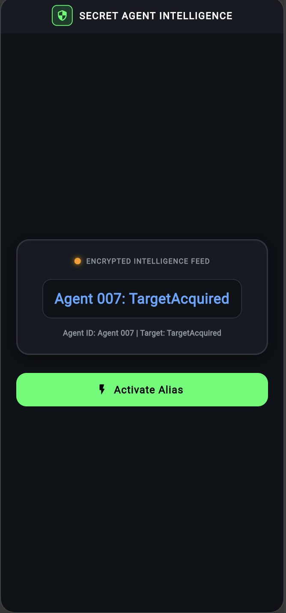
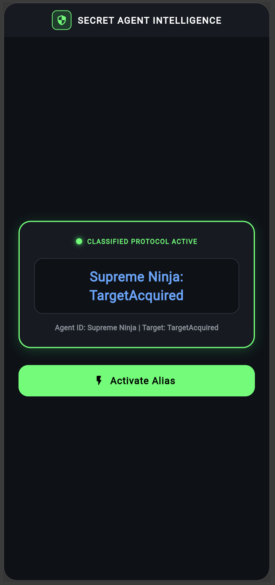

# 🕵️‍♂️ Secret Agent Intelligence System

> **Riverpod & GoRouter State Management Challenge**  
> Resolving a security breach by upgrading the agent alias protocol from guest access to top-secret classified status using **Flutter Riverpod** (`StateNotifierProvider`) and **GoRouter** (`ShellRoute`).

---

## 📱 Application Screenshots

| 1. Initial State (Before Activation) | 2. Alias Activated (After Action) |
| :---: | :---: |
|  |  |
| `Agent 007: TargetAcquired` *(Initial Protocol)* | `Supreme Ninja: TargetAcquired` *(Alias Activated)* |

---

## 🎯 Mission Objectives & Implementation

### 1. 🛡️ Initial State Breach Fix
- **Issue**: The system was initialized with `'Guest'`, creating a security vulnerability.
- **Fix**: Configured `UserNotifier` with default state `'Agent 007'`.

```dart
class UserNotifier extends StateNotifier<String> {
  // Requirement 1: Initial state set to 'Agent 007'
  UserNotifier() : super('Agent 007');

  void set(String alias) => state = alias;
}

final userProvider = StateNotifierProvider<UserNotifier, String>((ref) {
  return UserNotifier();
});
```

---

### 2. 🌐 GoRouter Target Route Update
- **Old Route**: `/shell/details/Alex`
- **Updated Route**: `/shell/details/TargetAcquired`

```dart
final agentRouterProvider = Provider<GoRouter>((ref) {
  return GoRouter(
    // Requirement 4: Initial location updated
    initialLocation: '/shell/details/TargetAcquired',
    routes: [
      ShellRoute(
        builder: (context, state, child) => AgentShellScreen(child: child),
        routes: [
          GoRoute(
            path: '/shell/details/:target',
            builder: (context, state) {
              final target = state.pathParameters['target'] ?? 'TargetAcquired';
              return DetailScreen(target: target);
            },
          ),
        ],
      ),
    ],
  );
});
```

---

### 3. ⚡ "Activate Alias" Action & State Mutation
- **Button Label**: `"Activate Alias"`
- **Action Trigger**: Invokes `ref.read(userProvider.notifier).set('Supreme Ninja')` to update the reactive Riverpod state.

```dart
ElevatedButton.icon(
  onPressed: () {
    // Requirement 3: Trigger state change to 'Supreme Ninja'
    ref.read(userProvider.notifier).set('Supreme Ninja');
  },
  icon: const Icon(Icons.flash_on_rounded),
  label: const Text('Activate Alias'),
)
```

---

## 📊 Expected Output Verification

| Stage | Display Output | Description |
| :--- | :--- | :--- |
| **Before Clicking** | `Agent 007: TargetAcquired` | Default agent identity and classified route target. |
| **After Clicking** | `Supreme Ninja: TargetAcquired` | Instant reactive UI update triggered via Riverpod `ref.read(...)`. |

---

## 🛠️ Technical Architecture

| Layer | Technology | Description |
| :--- | :--- | :--- |
| **Framework** | Flutter 3.x / Dart 3.x | Cross-platform UI toolkit |
| **State Management** | **Flutter Riverpod 2.5.1** | `StateNotifierProvider` & `ConsumerWidget` |
| **Routing** | **GoRouter 14.8.1** | `ShellRoute` & dynamic path parameters (`:target`) |
| **Theme** | Stealth Cyber Terminal | Dark background (`#0D1117`), Neon Green (`#00FF66`), Cyber Blue (`#58A6FF`) |

---

## 🚀 Running the Application & Automated Tests

### Run on Flutter Web / Device
```bash
# 1. Fetch dependencies
flutter pub get

# 2. Run app
flutter run -d chrome
# or
flutter run -d web-server --web-port 8080
```

### Run Automated Unit & Widget Tests
```bash
flutter test
flutter analyze
```

---

## 👨‍💻 Author Information
- **Student Name**: Prince Vaviya
- **Student Roll No**: `150096724005`
- **Course**: Dart Fundamentals & Flutter Cross-Platform Development
- **Topic**: Riverpod StateNotifier & GoRouter Deep Linking Challenge
