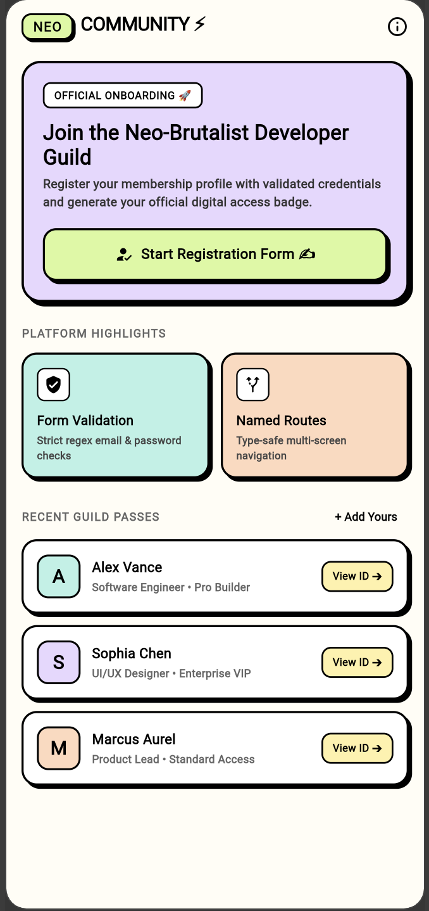
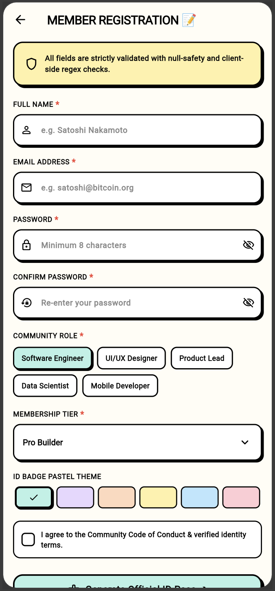
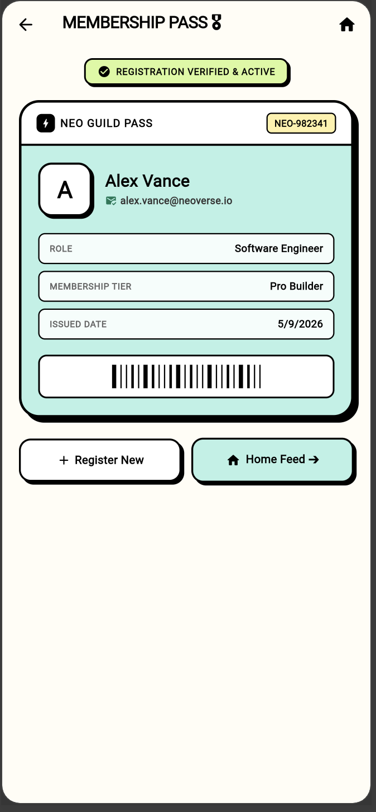

# ⚡ NeoRegister — 3-Screen Membership Onboarding App

> A robust, 3-screen registration and digital membership application built with **Flutter**, featuring **Named Route Navigation**, strict **Form Validation** (email regex, password security, required fields), backed by a strongly-typed **`UserRegistration` Data Model**, and designed with a vibrant **Neo-Brutalist Soft Pastel aesthetic**.

---

## 📱 Application Screenshots & User Journey

| 1. Home Screen (`/`) | 2. Registration Form (`/form`) | 3. Digital ID Pass (`/detail`) |
| :---: | :---: | :---: |
|  |  |  |
| *Hero onboarding banner & recent member pass list* | *Validated form fields, role chips & tier selector* | *Official verified digital ID badge with QR barcode* |

---

## 🧭 3-Screen Navigation & Named Routes Architecture

The application demonstrates decoupled, type-safe screen transitions using **Flutter's Named Routing System**:

```
┌────────────────────────┐      Navigator.pushNamed('/form')      ┌────────────────────────┐
│      HomeScreen        │ ──────────────────────────────────────> │ RegistrationFormScreen │
│   (Route: '/')         │                                         │   (Route: '/form')     │
└────────────────────────┘                                         └────────────────────────┘
          ▲                                                                    │
          │                                                                    │ Navigator.pushNamed(
          │                      Navigator.popUntil(ModalRoute.withName('/'))  │   '/detail',
          │                                                                    │   arguments: user
          │                                                                    ▼
          │                                                        ┌────────────────────────┐
          └─────────────────────────────────────────────────────── │      DetailScreen      │
                                                                   │   (Route: '/detail')   │
                                                                   └────────────────────────┘
```

### 🗺️ Route Mapping Table

| Route Name | Target Screen Widget | Navigation Method | Data Transmission |
| :--- | :--- | :--- | :--- |
| `'/'` | `HomeScreen` | `initialRoute` | Root landing page |
| `'/form'` | `RegistrationFormScreen` | `Navigator.pushNamed(context, '/form')` | Onboarding trigger |
| `'/detail'` | `DetailScreen` | `Navigator.pushNamed(context, '/detail', arguments: newUser)` | Passes `UserRegistration` model |

---

## 🔒 Form Validation Engine & Security Rules

The registration form is backed by a **`GlobalKey<FormState>`** enforcing client-side validation rules before submission:

| Field | Validation Rules | Error Feedback |
| :--- | :--- | :--- |
| **Full Name** | Required, trimmed length $\ge 3$ characters | `"Full name must be at least 3 characters"` |
| **Email Address** | Required, regex pattern: `^[\w-\.]+@([\w-]+\.)+[\w-]{2,4}$` | `"Enter a valid email address (e.g. name@domain.com)"` |
| **Password** | Required, minimum $\ge 8$ characters, visibility toggle (👁️) | `"Password must be at least 8 characters long"` |
| **Confirm Password** | Required, must strictly equal Password field value | `"Passwords do not match"` |
| **Terms & Conduct** | Required checkbox confirmation | `"You must accept the community terms & code of conduct."` |

---

## 🎨 Neo-Brutalism & Soft Pastel Design System

The UI combines the bold geometry of **Neo-Brutalism** with the gentle contrast of **Soft Pastel tones**:

| Token Name | Hex Code | Visual Application | Role in UI |
| :--- | :--- | :--- | :--- |
| **Pastel Mint** | `#B8F2E6` | Submit CTA button, Home action tag | Primary interactive action |
| **Pastel Lilac** | `#E8D7FF` | Hero onboarding banner | Main visual anchor |
| **Pastel Butter** | `#FFF1A8` | Form instruction notice, ID badge tag | Notice alert & highlight |
| **Pastel Peach** | `#FFD8BE` | Feature pillar card, Role selector | Secondary category accent |
| **Pastel Lime** | `#D9F99D` | Brand header logo pill (`NEO`), Active status | Verification & logo badge |
| **Pastel Rose** | `#FFCCD5` | Required asterisks (`*`), Error alerts | Warning & error states |
| **Pure Black** | `#000000` | 2.5px chunky borders, hard shadows (`Offset(4, 4)`) | Structural outline |
| **Warm Milk** | `#FFFDF5` | Scaffold background canvas | Soft off-white backdrop |

---

## 🛠️ Technical Stack & Architecture

| Layer | Implementation | Description |
| :--- | :--- | :--- |
| **Framework** | Flutter 3.x / Dart 3.x | Cross-platform UI toolkit |
| **Navigation** | **Named Routes** (`initialRoute`, `routes`) | Multi-screen navigation with route arguments |
| **Form Handling** | `Form`, `GlobalKey<FormState>`, `TextFormField` | Client-side validation & controller disposal |
| **Data Layer** | Strongly-typed `UserRegistration` model | ID generation, timestamps, pastel color tokens |
| **Design Tokens** | Custom `NeoTheme` helper | Zero-blur hard shadows, rounded neo-boxes |

---

## 🚀 Getting Started & Running Locally

### Prerequisites
- [Flutter SDK](https://docs.flutter.dev/get-started/install) (`>=3.3.0`)
- Google Chrome, macOS, or an Android/iOS Simulator

### Quick Start
```bash
# 1. Clone the repository
git clone https://github.com/Prince-Vaviya/EMBatchAssignments.git
cd EMBatchAssignments

# 2. Switch to the multi-screen-app branch
git checkout multi-screen-app

# 3. Get dependencies
flutter pub get

# 4. Run on Flutter Web or Device
flutter run -d chrome
# or
flutter run -d web-server --web-port 8080
```

### Running Automated Widget Tests
```bash
# Runs full 3-screen navigation flow & validation tests
flutter test
flutter analyze
```

---

## 📂 Project Structure

```text
lib/
├── main.dart                               # App entry point & Named Routes table
├── models/
│   └── user_registration.dart              # UserRegistration data model
├── screens/
│   ├── neo_home_screen.dart                # Screen 1: Home landing & member preview
│   ├── neo_registration_form_screen.dart   # Screen 2: Validated registration form
│   └── neo_detail_screen.dart              # Screen 3: Digital Membership ID pass
└── theme/
    └── neo_brutalist_pastel_theme.dart     # Neo-Brutalist soft pastel color palette & helpers
test/
└── neo_registration_test.dart              # Automated 3-screen widget & validation test
```

---

## 👨‍💻 Author Information
- **Student Name**: Prince Vaviya
- **Student Roll No**: `150096724005`
- **Course**: Dart Fundamentals & Flutter Cross-Platform Development
- **Topic**: 3-Screen App with Named Routes & Form Validation (`GlobalKey<FormState>`)
