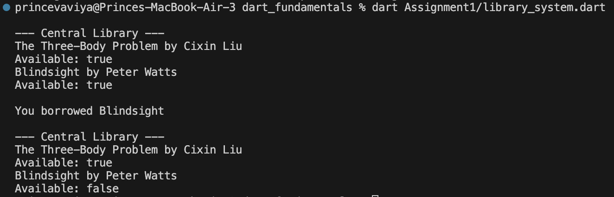

# Dart Fundamentals - Assignment 1: Library System

A simple and beginner-friendly console-based Library Management System written in Dart. This project demonstrates core Dart concepts including Object-Oriented Programming (OOP), collections, control flow, functions, and classes.

---

## 📌 Features

- **Book Modeling**: Represents books with title, author, and availability status.
- **Library Catalog**: Add and store multiple books using Dart `List`.
- **View Inventory**: Display all books in the catalog along with their real-time availability.
- **Borrow System**: Allows borrowing available books and updating their status automatically.

---

## 🧠 Concepts Covered

| Concept | Implementation in Code |
| :--- | :--- |
| **Classes & Objects** | `Book` and `Library` classes |
| **Constructors** | Parameterized constructors (`Book(this.title, this.author)`) |
| **Collections** | `List<Book>` to manage inventory |
| **Control Flow & Loops** | `for-in` loops to traverse books and `if` conditions to check availability |
| **Methods** | `addBook()`, `showBooks()`, `borrowBook()`, and `displayBook()` |

---

## 📂 Project Structure

```text
dart_fundamentals/
└── Assignment1/
    └── library_system.dart
```

---

## 🚀 How to Run

Ensure you have the [Dart SDK](https://dart.dev/get-dart) installed on your system.

1. Navigate to the project directory:
   ```bash
   cd Assignment1
   ```

2. Run the application:
   ```bash
   dart library_system.dart
   ```

---

## 🖥️ Sample Output

```text
--- Central Library ---
The Three-Body Problem by Cixin Liu
Available: true
Blindsight by Peter Watts
Available: true

You borrowed Blindsight

--- Central Library ---
The Three-Body Problem by Cixin Liu
Available: true
Blindsight by Peter Watts
Available: false
```
