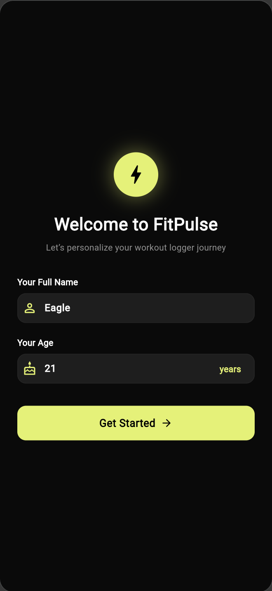
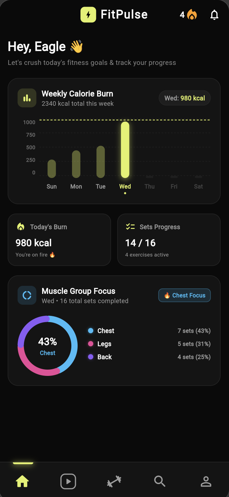
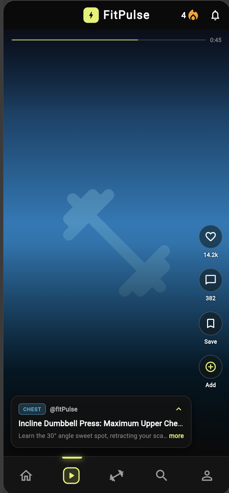
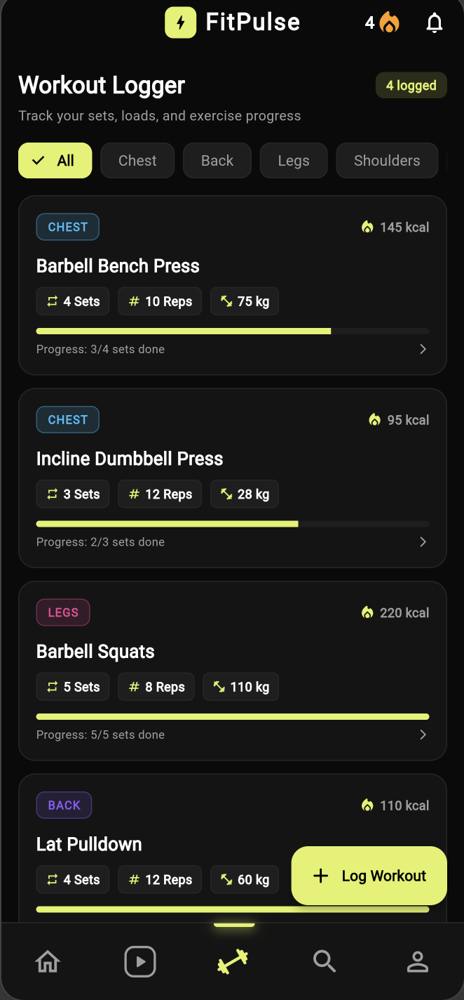
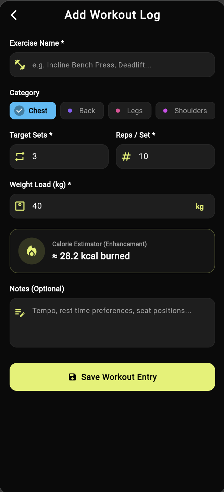
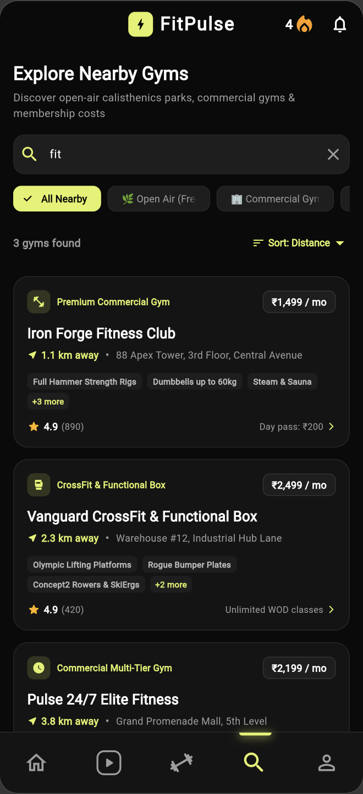
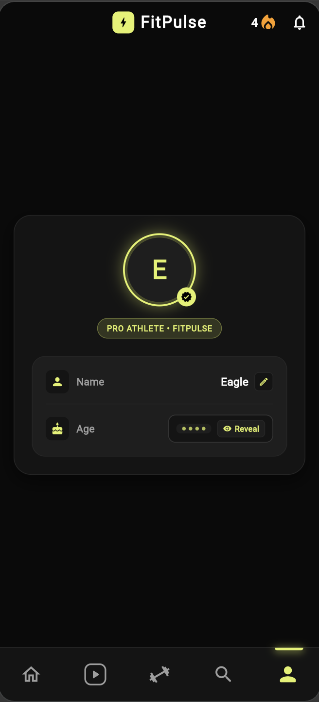
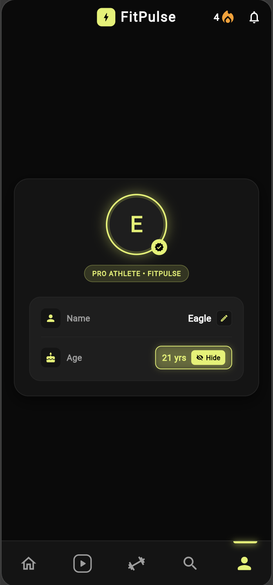

# ⚡ FitPulse — Smart Workout Logger & Fitness Companion

> **Assignment Topic**: Case Study 02 — Workout Logger  
> **Student Roll No**: `150096724005`  
> **Theme Aesthetic**: Pure Pitch Black (`#0A0A0A`), Deep Graphite (`#141414`), and Classic Electric Lime (`#E2F163`) with Vibrant Category Accents.

---

## 📱 Application Screenshots & User Experience

### 🚀 Core Journey & Analytics

| 1. Onboarding Flow | 2. Home Dashboard | 3. Video Form Reels | 4. Add Workout Form |
| :---: | :---: | :---: | :---: |
|  |  |  |  |
| *Athlete Name & Age Setup* | *Weekly Calorie Graph & Muscle Ring* | *Vertical Instagram Reels Form Guides* | *Live Dynamic Calorie Estimator* |

<br/>

### 🏋️‍♂️ Workout Logger, Gym Discovery & Privacy Profile

| 5. Workout Logger | 6. Gym & Park Discovery | 7. Profile (Age Hidden) | 8. Profile (Age Revealed) |
| :---: | :---: | :---: | :---: |
|  |  |  |  |
| *Category Filters & Set Progress* | *Free Open Gyms & Commercial Costs* | *Frosted Particle Privacy Blur* | *Smooth Tap-to-Reveal Animation* |

---

## 🌟 Core Features & Modules

### 1. 🚀 Onboarding & Personalized Athlete Profile
- **First-Time Setup**: Greets the user, collects Full Name and Age, and persists state with Riverpod.
- **Privacy Age Blur**: Profile page features frosted glass particle blur (`● ● ● ●`) concealing user age with a smooth tap-to-reveal toggle.
- **Top App Bar**: Centered brand header with dynamic active streak counter (`🔥 4`) and notification bell.

### 2. 📊 Home Dashboard & Weekly Calorie Analytics
- **Weekly Calorie Burn Bar Graph (Sun — Sat)**:
  - Dynamic height bars color-coded in electric lime.
  - **Numeric Y-Axis Scale** (*e.g., 1000, 750, 500, 250, 0 kcal*).
  - **Dynamic Dotted Projection Line**: Smoothly glides across the graph connecting the selected day's burn height directly to the Y-axis label.
  - **Future-Day Safety**: Automatically suppresses and zeroes out future days.
- **Summary Metrics**: Real-time *"Today's Burn"* and *"Sets Progress"* tracker.
- **Muscle Group Focus Donut Ring Chart**:
  - Interactive multi-segment ring chart with dedicated vibrant color discrimination (*Sky Blue for Chest, Violet for Back, Pink for Legs, Magenta for Shoulders, Orange for Arms*).
  - Center percentage readout (*e.g., `43% Chest`*) and comprehensive set distribution breakdown.

### 3. 🎬 Workout Form Video Reels
- **Vertical Snapping Feed**: High-definition exercise form guides in an Instagram Reels / TikTok format.
- **Interactive Action Bar**: ❤️ Like button with live counter, 💬 comments, 🔖 bookmarking, and `+ Add` to quick-log exercises.
- **Expandable Bottom Sheet Guide**: Tap to expand detailed technique checklists, target muscle groups, and common mistakes to avoid.

### 4. 🏋️‍♂️ Dedicated Workout Logger
- **Category Filter Chips**: Filter exercises by `All`, `Chest`, `Back`, `Legs`, `Shoulders`, `Arms`, `Core`, and `Cardio`.
- **Set Progress Tracker**: Visual progress bar indicating completed vs. target sets with interactive completion checkoffs.
- **Rest Countdown Timer**: Dedicated workout details screen featuring 30s, 60s, 90s, and 120s rest interval presets with audio/haptic pulse.

### 5. 📍 Nearby Gym Search & Discovery
- **Comprehensive Database**: Find nearby public open-air calisthenics parks (`FREE`) and commercial fitness clubs.
- **Transparent Pricing**: Displays monthly membership costs (*e.g. ₹1,499 / mo*) and day pass rates.
- **Live Details Modal**: Distance indicators, live crowd density status (`Low 🟢`, `Moderate 🟡`, `Busy 🔴`), operating hours, equipment checklists, and GPS directions.

### 6. 🎨 Custom Bottom Navigation Bar
- **5 Custom Nav Destinations**: Home (`0`), Video Reels (`1`), Workout Logger (`2`), Gym Search (`3`), and Profile (`4`).
- **Custom Squircle Play Video Icon & Rotated Dumbbell Icon**.
- **Sliding Neon Indicator Bar**: Glides across tabs with cubic bezier easing.

---

## 🛠️ Architecture & Technical Stack

| Layer | Technology |
|---|---|
| **Framework** | Flutter 3.x (Web, iOS, Android, macOS) |
| **State Management** | **Flutter Riverpod 2.5.1** (`StateNotifierProvider`, `ConsumerWidget`) |
| **Routing & Navigation** | **GoRouter 14.8.1** (`/onboarding`, `/`, `/add`, `/details/:id`) |
| **Language Features** | **Dart Null Safety** (`?`, `!`, `late`, `??`, `sealed`/`final` models) |
| **Design System** | Custom `AppTheme` (Pitch Black `#0A0A0A`, Electric Lime `#E2F163`, Neon Category Palette) |

---

## 🏗️ State Architecture & Null Safety Demonstration

```dart
/// Null-safe WorkoutLoggerItem Model
class WorkoutLoggerItem {
  final String id;
  final String exerciseName;
  final String category;
  final int targetSets;
  final int completedSets;
  final double weightLoad;
  final int repetitions;
  final double? estimatedCalories; // Nullable demonstration (?)
  final DateTime createdAt;
  final String? notes; // Nullable demonstration (?)

  WorkoutLoggerItem({
    required this.id,
    required this.exerciseName,
    required this.category,
    required this.targetSets,
    this.completedSets = 0,
    required this.weightLoad,
    required this.repetitions,
    this.estimatedCalories,
    DateTime? createdAt,
    this.notes,
  }) : createdAt = createdAt ?? DateTime.now(); // Null-coalescing (??)

  double get calculatedCalories {
    if (estimatedCalories != null) {
      return estimatedCalories!; // Bang operator demonstration (!)
    }
    final double calc = (targetSets * repetitions * (weightLoad > 0 ? weightLoad : 50) * 0.0035) + (targetSets * 8.0);
    return double.parse(calc.toStringAsFixed(1));
  }
}
```

---

## 🚀 Running the Project Locally

### Prerequisites
- Flutter SDK (`>=3.3.0`)
- Dart SDK (`>=3.0.0`)

### Installation & Run
```bash
# 1. Clone repository
git clone https://github.com/Prince-Vaviya/EMBatchAssignments.git
cd EMBatchAssignments/fitpulse

# 2. Install dependencies
flutter pub get

# 3. Run on Flutter Web or Device
flutter run -d chrome
# or
flutter run -d web-server --web-port 8080
```

### Running Automated Unit & Widget Tests
```bash
flutter test
flutter analyze
```

---

## 👨‍💻 Project Information
- **Student Name**: Prince Vaviya
- **Student Roll No**: `150096724005`
- **Course**: Dart Fundamentals & Flutter Cross-Platform Development