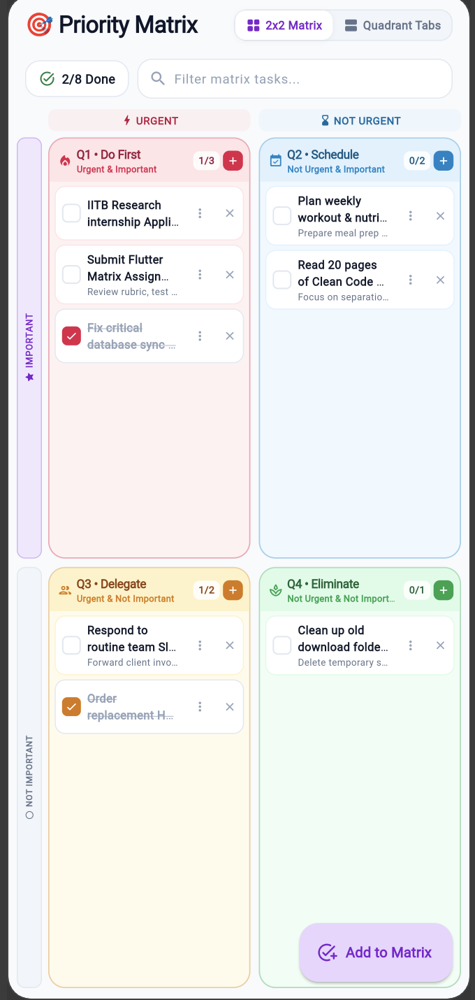
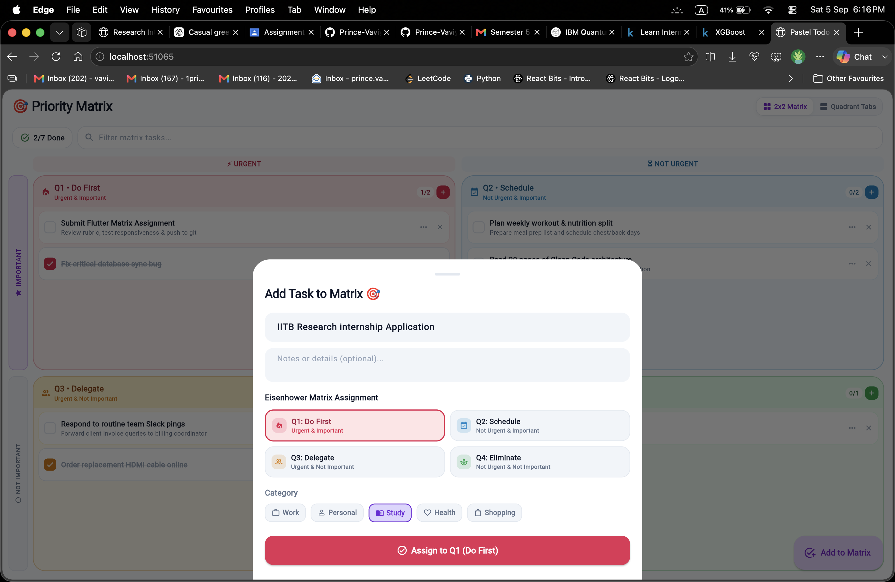
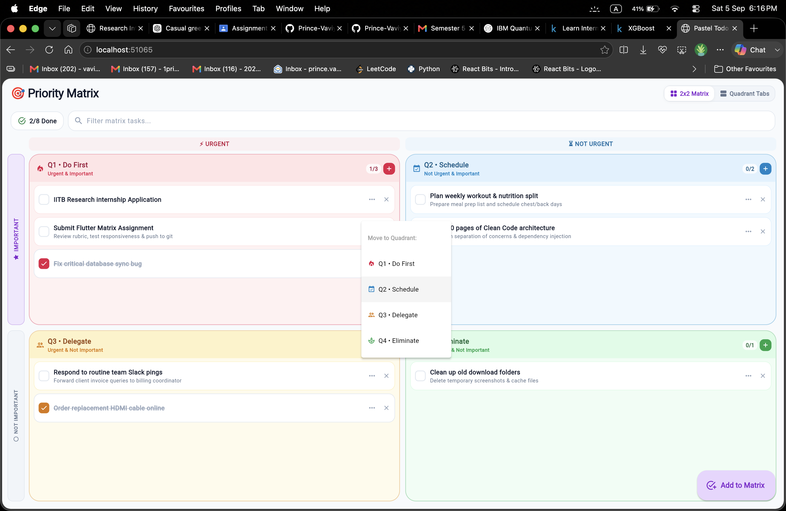
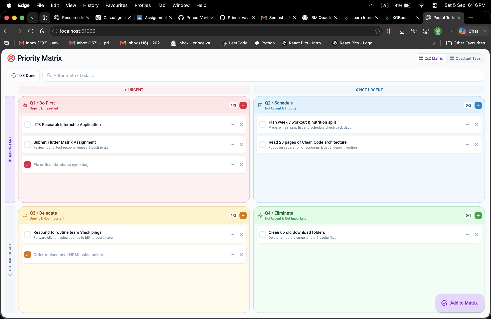

# 🎯 Priority Matrix — Eisenhower Todo & Task Planner

> A minimalist, soft pastel-themed task management application built with **Flutter**, powered by **`StatefulWidget`** and **`setState`**, leveraging the time-tested **Eisenhower Decision Matrix** (Urgency vs. Importance).

## 📱 Application Screenshots

| 1. 2x2 Matrix View | 2. Add Task Modal | 3. Move Quadrant Action | 4. Focus Quadrants Tab |
| :---: | :---: | :---: | :---: |
|  |  |  |  |
| *Dual-Axis 2x2 Matrix* | *Dynamic Urgency/Importance Picker* | *Instant Priority Migration* | *Single Quadrant Deep Focus* |

---

## 🌸 Visual Aesthetic & Soft Pastel Color System

The application uses a calming, distraction-free pastel color palette tailored for focused productivity:

| Quadrant | Priority | Role | Soft Pastel Tone |
| :--- | :--- | :--- | :--- |
| **Q1: Do First** | ⚡ Urgent & ★ Important | Crises, urgent deadlines, critical actions | **Soft Rose / Blush** (`#FFE4E6` / `#BE123C`) |
| **Q2: Schedule** | ⏳ Not Urgent & ★ Important | Strategic goals, planning, deep learning | **Soft Sky Blue** (`#E0F2FE` / `#0369A1`) |
| **Q3: Delegate** | ⚡ Urgent & ⚪ Not Important | Quick chores, interruptions, errands | **Soft Butter / Peach** (`#FEF3C7` / `#92400E`) |
| **Q4: Eliminate** | ⏳ Not Urgent & ⚪ Not Important | Distractions, low-value tasks, relax | **Soft Mint / Sage** (`#DCFCE7` / `#15803D`) |

---

## 🚀 Core Features & Capabilities

### 1. 🧭 Interactive 2x2 Decision Matrix
- **Dual-Axis Classification**:
  - **Horizontal (Top)**: `⚡ URGENT` vs `⏳ NOT URGENT`
  - **Vertical (Left)**: `★ IMPORTANT` vs `⚪ NOT IMPORTANT`
- **Responsive & Overflow-Safe**: Specifically optimized for both mobile screens and desktop/tablet viewports.
- **Instant Quick-Add (`+`)**: Directly add a task into any specific quadrant with one tap.

### 2. 📑 Focus Quadrant Tabs
- Switch between **2x2 Matrix View** and **Quadrant Tabs View** using the top app bar toggle.
- Allows deep focus on a single quadrant with detailed mission descriptions and category tags.

### 3. ⚡ Complete CRUD & State Management (`setState`)
- **➕ Add Tasks**: Set title, optional description, category (*Work, Personal, Study, Health, Shopping*), and toggle Urgency & Importance with live pastel preview.
- **✅ Mark Complete**: Interactive animated checkboxes apply strike-through formatting and update productivity progress in real-time.
- **🔄 Move Quadrant**: Reassign tasks dynamically between `Q1 ↔ Q2 ↔ Q3 ↔ Q4` via the action dropdown.
- **🗑️ Delete with Undo**: Remove tasks instantly with a floating pastel SnackBar containing an **UNDO** action.

### 4. 🔍 Real-Time Filter & Search
- Live search bar filters tasks instantly across all 4 quadrants simultaneously.
- Header progress pill displays completed vs. total task counts (`2/8 Done`).

---

## 🛠️ Architecture & Technical Stack

| Layer | Implementation |
| :--- | :--- |
| **Framework** | Flutter 3.x / Dart 3.x |
| **State Management** | **`StatefulWidget`** & native **`setState`** |
| **Design Tokens** | Custom `PastelTheme` (Material 3 Light) |
| **Models** | `TodoItem`, `EisenhowerQuadrant`, `TodoCategory` |
| **Layouts** | `Column`, `Row`, `Expanded`, `RotatedBox`, `ListView.builder` |

---

## 🚀 How to Run the Project

### Prerequisites
- [Flutter SDK](https://docs.flutter.dev/get-started/install) (`>=3.3.0`)
- Google Chrome, macOS, or an Android/iOS Simulator

### Quick Start
```bash
# 1. Clone the repository
git clone https://github.com/Prince-Vaviya/EMBatchAssignments.git
cd EMBatchAssignments

# 2. Switch to the todo-app branch
git checkout todo-app

# 3. Get dependencies
flutter pub get

# 4. Run on your desired platform
flutter run -d chrome
# or
flutter run -d web-server --web-port 8080
```

---

## 📂 Project Structure

```text
lib/
├── main.dart                  # App bootstrap & Theme configuration
├── models/
│   └── todo_item.dart         # EisenhowerQuadrant & TodoItem models
├── screens/
│   └── todo_screen.dart       # 2x2 Matrix & Tabbed Focus Screen (StatefulWidget)
└── theme/
    └── pastel_theme.dart      # Soft Pastel color palette & typography
```

---

## 👨‍💻 Author & Course Info
- **Student Name**: Prince Vaviya
- **Roll Number**: `150096724005`
- **Topic**: Assignment — Eisenhower Matrix Todo App (`StatefulWidget` & `setState`)