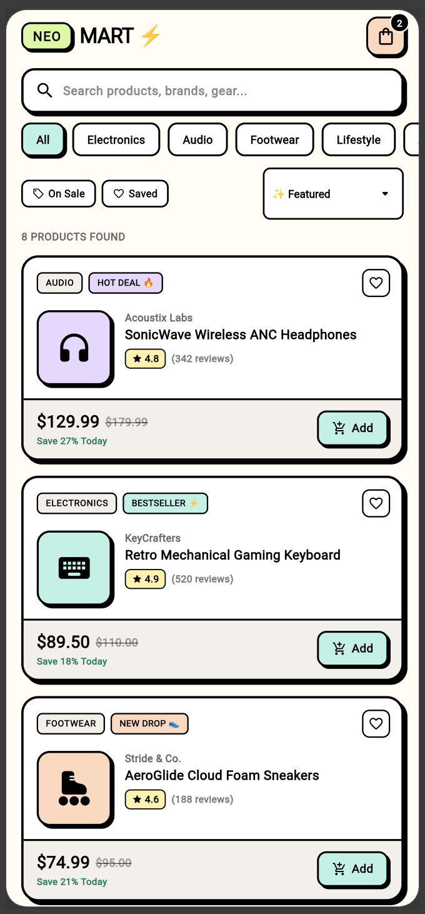
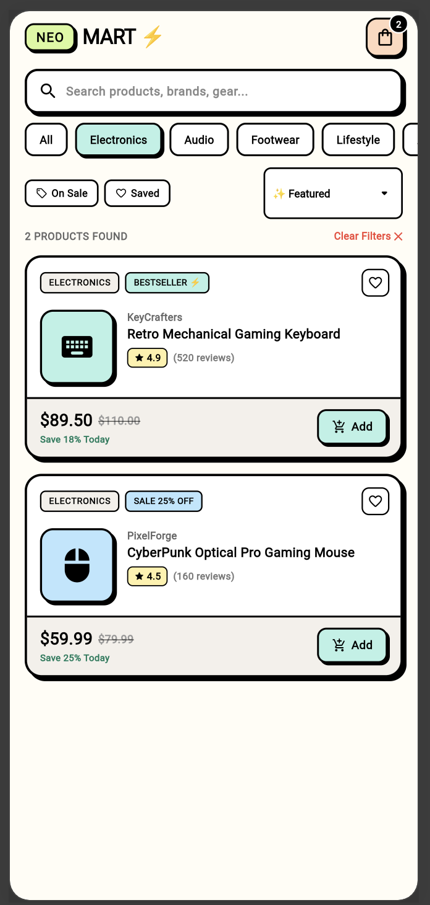
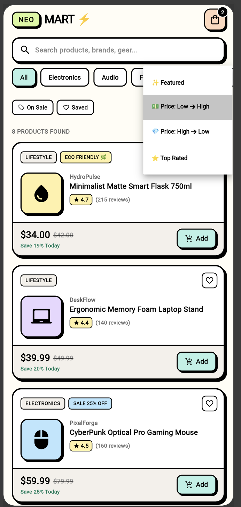

# ⚡ NeoMart — Neo-Brutalist Soft Pastel Product Listing

> A dynamic, high-impact e-commerce product catalog built with **Flutter**, featuring a **Neo-Brutalist soft pastel design system**, backed by a strongly-typed **`Product` Data Model**, powered by **`ListView.builder`**, and driven by real-time search, category filtering, and sorting using **`setState`**.

---

## 📱 Application Screenshots

| 1. Neo-Brutalist Product Feed | 2. Live Search & Filters | 3. Category & Sorting Filters |
| :---: | :---: | :---: |
|  |  |  |
| *Dynamic `ListView.builder` with hard shadows & pastel cards* | *Real-time keyword search & On-Sale / Saved toggles* | *Horizontal category carousel & Price/Rating sorting* |

---

## 🎨 Neo-Brutalism & Soft Pastel Design System

The application blends the raw energy of **Neo-Brutalism** (chunky black borders, hard zero-blur offset shadows, bold typography) with the gentle harmony of **Soft Pastel tones**:

| Token Name | Hex Code | Visual Application | Role in UI |
| :--- | :--- | :--- | :--- |
| **Pastel Mint** | `#B8F2E6` | Active Category Pill, "Add" Cart CTA | Primary interactive highlight |
| **Pastel Lilac** | `#E8D7FF` | Audio gear card, "Saved" Favorites chip | Secondary category & filter accent |
| **Pastel Peach** | `#FFD8BE` | Footwear card, Top Bar Cart badge | Cart indicator & lifestyle highlight |
| **Pastel Butter** | `#FFF1A8` | Rating pill, "Reset Filters" action | Review badge & alert CTA |
| **Pastel Sky** | `#BAE6FD` | Electronics card illustration box | Tech gear representation |
| **Pastel Rose** | `#FFCCD5` | "On Sale" chip, Favorite ❤️ toggle | Discount badges & active hearts |
| **Pastel Lime** | `#D9F99D` | Header brand logo pill (`NEO`) | Brand header accent |
| **Pure Black** | `#000000` | 2.5px solid borders, hard shadows | Neo-brutalist structural outline |
| **Warm Milk** | `#FFFDF5` | Scaffold background canvas | Soft off-white backdrop |

---

## 🌟 Core Features & State Operations (`setState`)

### 1. 📦 Strongly-Typed `Product` Data Model Class
- Defined in `lib/models/product.dart`.
- Properties: `id`, `name`, `brand`, `description`, `price`, `originalPrice`, `discountPercent`, `rating`, `reviewCount`, `category`, `pastelColor`, `icon`, `badge`, `inStock`, `isFavorite`.
- Computed getter `discountPercent` dynamically evaluates percentage savings (*e.g., "Save 27% Today"*).

### 2. 📜 Dynamic `ListView.builder` Feed
- Infinite-ready, performant list rendering via `ListView.builder`.
- Each card incorporates:
  - Header with Category Badge, Deal Tag (*"HOT DEAL 🔥"*, *"BESTSELLER ⚡"*), and Heart Favorite toggle.
  - Pastel illustration box with thematic product icons.
  - Multi-line title, brand subtitle, and star rating with review counts.
  - Bottom action bar with current price, strike-through original price, and an **"Add"** to Cart button.

### 3. 🔍 Real-Time Search & Keyword Matching
- Instant filtering across product **names**, **brands**, and **descriptions** as the user types in the search bar.
- Includes a quick clear (`✕`) action button.

### 4. 🏷️ Category Filter Carousel
- Horizontal scrollable filter bar with categories: `All`, `Electronics`, `Audio`, `Footwear`, `Lifestyle`, and `Accessories`.
- Highlights the active category with pastel mint fill and hard offset drop shadow.

### 5. ⚡ Quick Filter Toggles & Sorting Dropdown
- **On Sale Filter**: Filters products where `originalPrice > price`.
- **Saved / Favorites Filter**: Filters products marked as `isFavorite == true`.
- **Multi-Option Sort Menu**: Sort products by:
  - ✨ *Featured* (Default catalog order)
  - 💵 *Price: Low ➔ High*
  - 💎 *Price: High ➔ Low*
  - ⭐ *Top Rated* (Highest review scores)

### 6. 🛒 Interactive Cart & Favorite Actions
- Tapping **"Add"** increments the top-right cart notification badge and displays a floating neo-brutalist SnackBar with confirmation.
- Tapping ❤️ toggles the favorite state in-place with instant UI feedback.

### 7. 🚫 Zero-Results Empty State
- Displays a friendly empty state card with a one-tap **"Reset All Filters ⚡"** button when no items match active search criteria.

---

## 🛠️ Technical Stack & Architecture

| Layer | Technology |
| :--- | :--- |
| **Framework** | Flutter 3.x / Dart 3.x (Web, macOS, iOS, Android) |
| **State Management** | **`StatefulWidget`** & native **`setState`** |
| **Design System** | Custom `NeoBrutalistTheme` with hard shadows & pastel tokens |
| **Data Layer** | Strongly-typed `Product` class with `ProductCategory` enums |
| **Layout Widgets** | `ListView.builder`, `Column`, `Row`, `Expanded`, `AnimatedContainer`, `DropdownButton` |

---

## 🚀 Getting Started & Running Locally

### Prerequisites
- [Flutter SDK](https://docs.flutter.dev/get-started/install) (`>=3.3.0`)
- Google Chrome, macOS, or an Android/iOS Simulator

### Installation
```bash
# 1. Clone the repository
git clone https://github.com/Prince-Vaviya/EMBatchAssignments.git
cd EMBatchAssignments

# 2. Switch to the working branch
git checkout todo-app

# 3. Fetch dependencies
flutter pub get

# 4. Run on Chrome or Web Server
flutter run -d chrome
# or
flutter run -d web-server --web-port 8080
```

---

## 📂 Project Directory Structure

```text
lib/
├── main.dart                      # App entry point & Theme setup
├── models/
│   └── product.dart               # Product data model & Category enum
├── screens/
│   └── product_list_screen.dart   # Dynamic product listing & search/filter screen
└── theme/
    └── neo_brutalist_theme.dart   # Neo-Brutalist soft pastel color palette & shadow helpers
```

---

## 👨‍💻 Author Information
- **Student Name**: Prince Vaviya
- **Student Roll No**: `150096724005`
- **Course**: Dart Fundamentals & Flutter Cross-Platform Development
- **Topic**: Dynamic Product Listing (`ListView.builder`, Data Model, `setState`)
