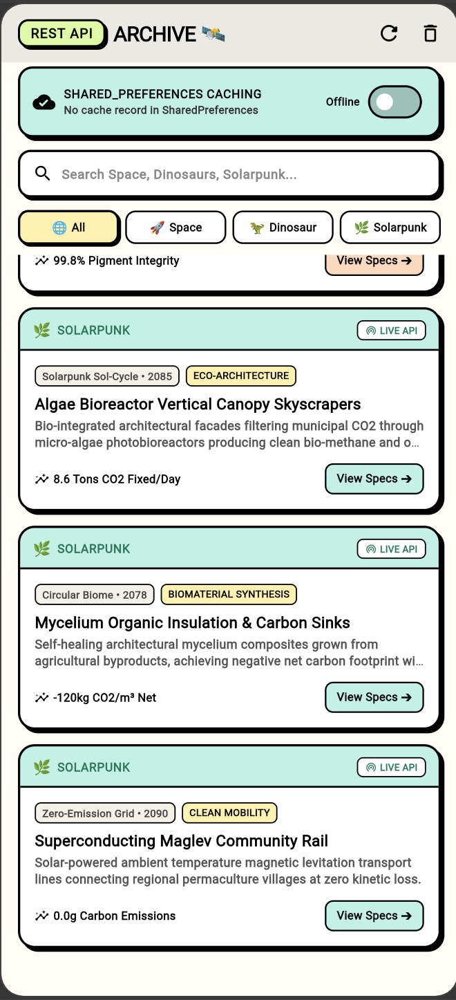
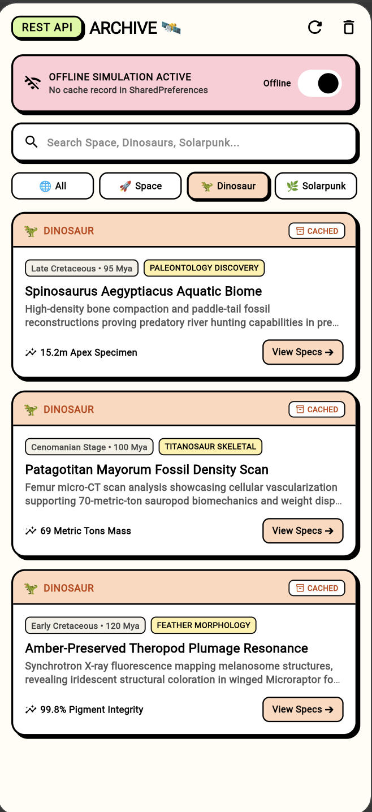
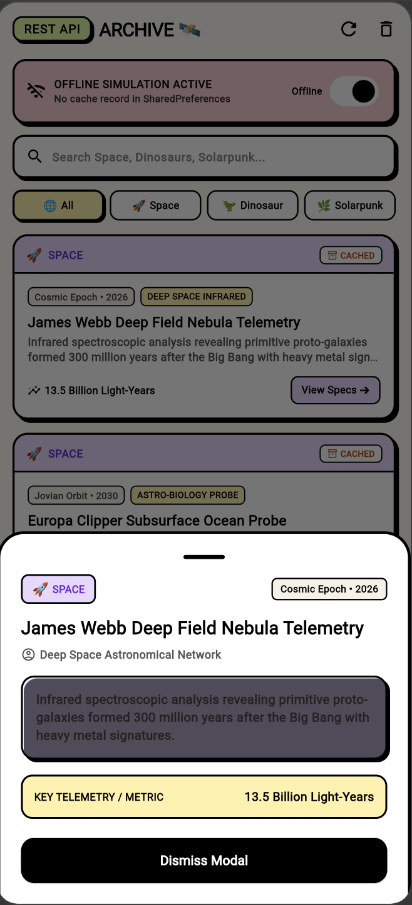

# ⚡ NeoArchive — REST API Fetcher with FutureBuilder & SharedPreferences Caching

> A performant, offline-first data explorer built with **Flutter**, demonstrating real-time **Public REST API integration**, asynchronous state management with **`FutureBuilder`**, persistent local caching using **`SharedPreferences`**, and thematic datasets spanning **Space Exploration**, **Prehistoric Paleontology**, and **Solarpunk Clean Future**.

---

## 📱 Application Screenshots & User Experience

| 1. Live REST API Feed | 2. Thematic Filters & Search | 3. Telemetry & Spec Modal |
| :---: | :---: | :---: |
|  |  |  |
| *`FutureBuilder` feed with live/cached status pills* | *Interactive Space, Dinosaur & Solarpunk filtering* | *Detailed metadata, metrics & telemetry inspection* |

---

## 🧭 Caching & Data Flow Architecture

```
   ┌────────────────────────────────────────────────────────┐
   │                  Public REST API / Web                 │
   └────────────────────────────────────────────────────────┘
                               │  (HTTP GET)
                               ▼
   ┌────────────────────────────────────────────────────────┐
   │                    ApiCacheService                     │
   │   • Serializes JSON payload                            │
   │   • Saves to SharedPreferences ('cached_archive_data') │
   │   • Offline failover & cache timestamping              │
   └────────────────────────────────────────────────────────┘
                               │
               ┌───────────────┴───────────────┐
               ▼                               ▼
   ┌───────────────────────┐       ┌───────────────────────┐
   │ SharedPreferences     │       │     FutureBuilder     │
   │   Local Cache Key     │ ────> │  • ConnectionState    │
   │   (Offline Access)    │       │  • hasData / hasError │
   └───────────────────────┘       └───────────────────────┘
                                               │
                                               ▼
                                   ┌───────────────────────┐
                                   │  Neo-Brutalist Cards  │
                                   │  • 🚀 Space           │
                                   │  • 🦖 Dinosaur        │
                                   │  • 🌿 Solarpunk       │
                                   └───────────────────────┘
```

---

## 🦖 Curated Thematic Mock Datasets

The application presents rich, curated records across 3 distinct scientific and speculative realms:

| Theme / Domain | Accent Token | Highlight Records & Metrics |
| :--- | :--- | :--- |
| **🚀 Space Exploration** | **Pastel Lilac** (`#E8D7FF` / `#6D28D9`) | • **James Webb Deep Field Nebula Telemetry**: *13.5B Light-Years*<br/>• **Europa Clipper Subsurface Ocean Probe**: *98.4% Salinity Match*<br/>• **Dyson Swarm Orbital Solar Harvester**: *4.2 Terawatts Peak* |
| **🦖 Dinosaurs & Paleo** | **Pastel Peach** (`#FFD8BE` / `#C2410C`) | • **Spinosaurus Aquatic Biome**: *15.2m Apex Specimen*<br/>• **Patagotitan Mayorum Density Scan**: *69 Metric Tons Mass*<br/>• **Amber-Preserved Plumage Resonance**: *99.8% Pigment Integrity* |
| **🌿 Solarpunk Future** | **Pastel Mint** (`#B8F2E6` / `#047857`) | • **Algae Bioreactor Vertical Canopy**: *8.6 Tons CO2 Fixed/Day*<br/>• **Mycelium Carbon-Negative Habitat**: *-120kg CO2/m³ Net*<br/>• **Superconducting Maglev Community Rail**: *0.0g Carbon Emissions* |

---

## ⚡ Core Features & State Management

### 1. 🔄 `FutureBuilder<List<ArchiveEntry>>` Asynchronous States
- **`ConnectionState.waiting`**: Displays custom Neo-Brutalist loading skeleton cards with pulse placeholder geometry.
- **`snapshot.hasError`**: Displays an error card with a one-tap **"Retry Fetch"** button and offline fallback indicator.
- **`snapshot.hasData`**: Renders the full catalog with pull-to-refresh (`RefreshIndicator`) and real-time search.

### 2. 💾 `SharedPreferences` Offline Persistence
- Persists raw serialized JSON and ISO timestamps under `cached_archive_json_data` and `cached_archive_sync_time`.
- Each card indicates data origin:
  - **`LIVE API`** (Green indicator): Freshly fetched from network stream.
  - **`CACHED`** (Orange indicator): Loaded instantly from local `SharedPreferences` storage.

### 3. 🕹️ Interactive Cache & Simulation Controls
- **Offline Switch**: Toggles offline mode to demonstrate local `SharedPreferences` caching without internet.
- **`🔄 Force Fetch`**: Manually requests fresh network data and updates local storage.
- **`🗑️ Clear Cache`**: Purges local storage to demonstrate cold-start fallback.
- **Modal Inspection**: Tapping any card opens a bottom sheet with comprehensive telemetry details.

---

## 🎨 Neo-Brutalism & Soft Pastel Design System

| Token Name | Hex Code | Visual Application | Role in UI |
| :--- | :--- | :--- | :--- |
| **Pastel Mint** | `#B8F2E6` | Solarpunk cards, Cache active banner | Ecological & cache state |
| **Pastel Lilac** | `#E8D7FF` | Space exploration cards & badges | Cosmic tech accent |
| **Pastel Peach** | `#FFD8BE` | Dinosaur & paleontology cards | Prehistoric discovery accent |
| **Pastel Butter** | `#FFF1A8` | Key metric pills, Reset button | Telemetry highlight |
| **Pastel Lime** | `#D9F99D` | Brand header logo pill (`REST API`) | Brand identity |
| **Pastel Rose** | `#FFCCD5` | Offline simulation active banner | Alert & offline state |
| **Pure Black** | `#000000` | 2.2px chunky borders, hard shadows (`Offset(3.5, 3.5)`) | Structural outline |
| **Warm Milk** | `#FFFDF5` | Scaffold background canvas | Soft off-white backdrop |

---

## 🛠️ Technical Stack & Architecture

| Layer | Implementation | Description |
| :--- | :--- | :--- |
| **Framework** | Flutter 3.x / Dart 3.x | Cross-platform UI toolkit |
| **Async State** | **`FutureBuilder`** | Asynchronous lifecycle handling (waiting, data, error) |
| **Caching Engine** | **`shared_preferences 2.5.5`** | Key-value disk persistence for JSON payloads |
| **Networking** | **`http 1.6.0`** | REST API HTTP client with timeout & failover |
| **Data Models** | `ArchiveEntry`, `ArchiveCategory` | Strongly-typed serialization (`toJson`, `fromJson`) |

---

## 🚀 Getting Started & Running Locally

### Prerequisites
- [Flutter SDK](https://docs.flutter.dev/get-started/install) (`>=3.3.0`)
- Google Chrome, macOS, or an Android/iOS Simulator

### Quick Start
```bash
# 1. Clone the repository
git clone https://github.com/Prince-Vaviya/EMBatchAssignments.git
cd EMBatchAssignments

# 2. Switch to the api-fetcher-feature branch
git checkout api-fetcher-feature

# 3. Fetch dependencies
flutter pub get

# 4. Run on Flutter Web or Device
flutter run -d chrome
# or
flutter run -d web-server --web-port 8080
```

### Running Automated Tests
```bash
flutter test
flutter analyze
```

---

## 📂 Project Structure

```text
lib/
├── main.dart                      # App entry point & NeoTheme configuration
├── models/
│   └── archive_entry.dart         # ArchiveEntry model & category enum
├── services/
│   └── api_cache_service.dart     # HTTP REST client & SharedPreferences cache logic
├── screens/
│   └── api_fetcher_screen.dart    # FutureBuilder UI & interactive caching controls
└── theme/
    └── neo_brutalist_pastel_theme.dart # Neo-Brutalist soft pastel color palette
test/
└── api_fetcher_test.dart          # Automated FutureBuilder & caching tests
```

---

## 👨‍💻 Author Information
- **Student Name**: Prince Vaviya
- **Student Roll No**: `150096724005`
- **Course**: Dart Fundamentals & Flutter Cross-Platform Development
- **Topic**: Public REST API Fetching with `FutureBuilder` & `SharedPreferences` Caching
